# Contributing to Signalco

Read about our [Commitment to Open Source](https://www.signalco.io/oss).

## Questions and requests

You can use in-app contact form if you wan't to propose new feature, report a bug or have a question.

_NOTE: In-app contact form is still in development. Use GitHub issues for actions mentioned above._

## Localization

You can contribute and help us localize the app.

We are investigating how to simplify localization, but for now you can contribute by creating a Pull-Request with changes. App localizations are located in `locales` directory of this repository. You can review existing localizations or create a new one by copying one of existing localizations and populate it with data.

## Development

See out [Development](/DEVELOPMENT.md) guides for more info.

## What can I contribute to?

Current state of products we are developing (2023-12-24):

```mermaid
stateDiagram-v2
    🏗️signalco.io
    🏗️signalco.io --> 🏗️doprocess.app

    🏗️uier.io

    🏗️doprocess.app
    
    🏗️slco.io
    🏗️slco.io --> 🏗️signalco.io

    🏗️brandgrab.io
    🏗️brandgrab.io --> 🏗️uier.io

    🏗️remoteBrowser
    🏗️remoteBrowser --> 🏗️brandgrab.io
    🏗️remoteBrowser --> 🏗️uier.io
    🏗️remoteBrowser --> 🏗️signalco.io

    💡diff
    
    💡regex
    
    💡roadmap
    💡roadmap --> 🏗️signalco.io
    💡roadmap --> 🏗️brandgrab.io
    💡roadmap --> 🏗️slco.io
    💡roadmap --> 🏗️doprocess.app
    💡roadmap --> 🏗️uier.io

    💡featureFlags
    💡featureFlags --> 🏗️signalco.io
    💡featureFlags --> 🏗️uier.io
    💡featureFlags --> 🏗️doprocess.app
    💡featureFlags --> 🏗️slco.io
    💡featureFlags --> 🏗️brandgrab.io
    
    💡community
    💡community --> 🏗️signalco.io
    💡community --> 🏗️uier.io
    💡community --> 🏗️doprocess.app
    💡community --> 🏗️slco.io
    💡community --> 🏗️brandgrab.io
    
    💡apiDocs
    💡apiDocs --> 🏗️signalco.io
    💡apiDocs --> 🏗️uier.io
    💡apiDocs --> 🏗️doprocess.app
    💡apiDocs --> 🏗️slco.io
    💡apiDocs --> 🏗️brandgrab.io
    
    💡imageBuilder
    💡imageBuilder --> 🧪CMS
    
    💡QRGenerator
    💡QRGenerator --> 🏗️slco.io
    💡QRGenerator --> 🏗️doprocess.app
    💡QRGenerator --> 🏗️signalco.io
    
    💡imageBuilder --> 💡QRGenerator
    
    🧪CMS
    🧪CMS --> 🏗️signalco.io
    🧪CMS --> 🏗️uier.io
    🧪CMS --> 🏗️doprocess.app
    🧪CMS --> 🏗️slco.io
    🧪CMS --> 🏗️brandgrab.io
    
    💡CRON
    💡CRON --> 🏗️signalco.io
    💡CRON --> 💡statusPages
    
    💡statusPages
    💡statusPages --> 🏗️signalco.io
    💡statusPages --> 🏗️uier.io
    💡statusPages --> 🏗️doprocess.app
    💡statusPages --> 🏗️slco.io
    💡statusPages --> 🏗️brandgrab.io
    
```

Legend

💡 Ideating
🧪 Working on POC
🏗️ In progress (preparing MVP)
